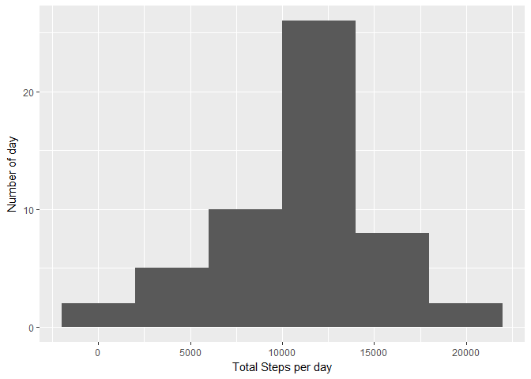
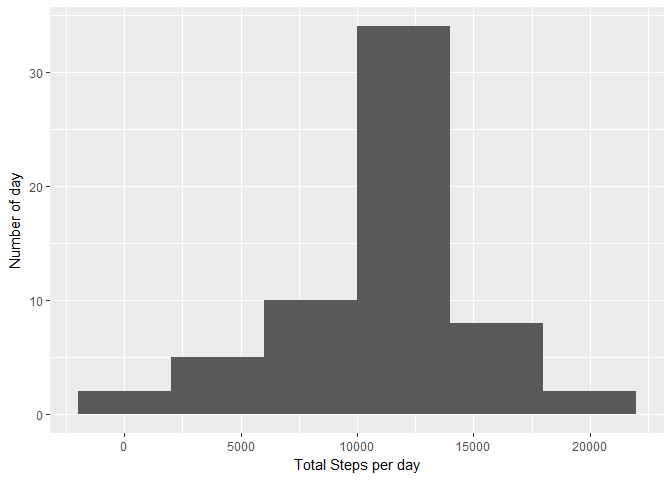

# Reproducible Research: Peer Assessment 1


## loading needed package

```r
library(ggplot2)
```

## Loading and preprocessing the data


```r
activity_data <- read.csv("activity/activity.csv")
```

## What is mean total number of steps taken per day?

**1. Calculate the total number of steps taken per day**

```r
activityByDay <- aggregate(steps ~ date, activity_data, sum)
```

**2. histogram of the total number of steps taken each day**

```r
qplot(steps, data = activityByDay, xlab = "Total Steps per day", ylab = "Number of day", binwidth = 4000)
```

<!-- -->

**3. Calculate and report the mean and median of the total number of steps taken per day**

```r
mean(activityByDay$steps)
```

```
## [1] 10766.19
```


```r
median(activityByDay$steps)
```

```
## [1] 10765
```

## What is the average daily activity pattern?

**1. Make a time series plot (i.e. type = "l") of the 5-minute interval (x-axis) and the average number of steps taken, averaged across all days (y-axis)**


```r
stepsByInterval <- aggregate(steps ~ interval, activity_data, mean)

plot(stepsByInterval$interval, stepsByInterval$steps, type='l', 
     main="Average number of steps over all days", xlab="Interval", 
     ylab="Average number of steps")
```

<!-- -->

**2. Which 5-minute interval, on average across all the days in the dataset, contains the maximum number of steps?**


```r
maxStepsRow <- which.max(stepsByInterval$steps)
stepsByInterval[maxStepsRow, ]
```

```
##     interval    steps
## 104      835 206.1698
```

## Imputing missing values

**1.Calculate and report the total number of missing values in the dataset (i.e. the total number of rows with NAs)**

number of missing value

```r
sum(is.na(activity_data$steps))
```

```
## [1] 2304
```


**2. Devise a strategy for filling in all of the missing values in the dataset. The strategy does not need to be sophisticated.**

I choose to replace the missing values by the mean for that 5 minutes interval

**3.Create a new dataset that is equal to the original dataset but with the missing data filled in.**


```r
activity_NoNA <- activity_data
for (i in 1:nrow(activity_NoNA)) {
  if (is.na(activity_NoNA$steps[i])) {
    intervalValue <- activity_NoNA$interval[i]
    stepsValue <- stepsByInterval[
      stepsByInterval$interval == intervalValue,]
    activity_NoNA$steps[i] <- stepsValue$steps
  }
}
```

**4. Make a histogram of the total number of steps taken each day and Calculate and report the mean and median total number of steps taken per day.**


```r
activityByDay_NoNA <- aggregate(steps ~ date, activity_NoNA, sum)
qplot(steps, data = activityByDay_NoNA, xlab = "Total Steps per day", ylab = "Number of day", binwidth = 4000)
```

<!-- -->

calculate mean and median

```r
mean(activityByDay_NoNA$steps)
```

```
## [1] 10766.19
```


```r
median(activityByDay_NoNA$steps)
```

```
## [1] 10766.19
```

The median value is slightly higher with missing value removed.

## Are there differences in activity patterns between weekdays and weekends?

**1. Create a new factor variable in the dataset with two levels - "weekday" and "weekend" indicating whether a given date is a weekday or weekend day.**

```r
activity_NoNA['typeOfDay'] <- weekdays(as.Date(activity_NoNA$date, "%Y-%m-%d"))
activity_NoNA$typeOfDay[activity_NoNA$typeOfDay  %in% c('samedi','dimanche') ] <- "weekend"
activity_NoNA$typeOfDay[activity_NoNA$typeOfDay != "weekend"] <- "weekday"

activity_NoNA$typeOfDay <- as.factor(activity_NoNA$typeOfDay)
```

**2. Make a panel plot containing a time series plot (i.e. type = "l") of the 5-minute interval (x-axis) and the average number of steps taken, averaged across all weekday days or weekend days (y-axis).**


```r
stepsByInterval_NoNA <- aggregate(steps ~ interval + typeOfDay, activity_NoNA, mean)

qplot(interval, steps, 
      data = stepsByInterval_NoNA, 
      geom=c("line"),
      xlab = "Interval", ylab = "Number of steps", 
      main = "") +
  facet_wrap(~ typeOfDay, ncol = 1)
```

<!-- -->
